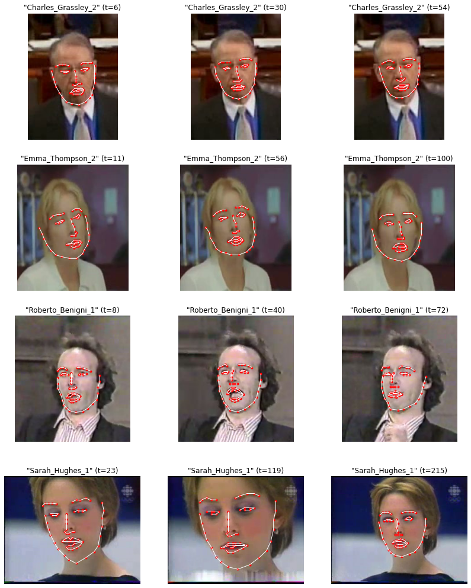

## Использование датасета YouTube Faces с ключевыми точками лица

**Описание датасета:** Датасет YouTube Faces с ключевыми точками лица представляет собой обработанную версию оригинального датасета YouTube Faces. Изначально он содержал короткие видео знаменитостей, которые были публично доступны и загружены с YouTube. В каждом видео может быть до 6 видеороликов на одного знаменитого человека. Видео были обрезаны вокруг лиц, и оставлены только последовательные кадры до 240 кадров для каждого оригинального видео. Это было сделано для экономии дискового пространства и упрощения использования датасета.

## Ключевые особенности:

**Количество видео:** Около 2200 видео. 
**Количество уникальных лиц:** Более 800 уникальных лиц. 
**Ключевые точки лица:** Для каждого кадра каждого видео были извлечены ключевые точки лица с использованием передовой библиотеки для 2D и 3D выравнивания лица. 
**Качество данных:** Были удалены все видео с крайне плохой разметкой ключевых точек. 

https://www.kaggle.com/datasets/selfishgene/youtube-faces-with-facial-keypoints

## Структура данных

Проект по распознаванию лиц на видео с использованием датасета YouTube Faces. В каждой директории содержатся файлы формата `.npz`.

### Директории и файлы

FaceRecognition-YouTubeFaces/  
│  
├── assets/  
│   └── dataset_example_image.png  
│  
├── data/  
│   ├── youtube_faces_with_keypoints_full_1/  
│       │    ├── Aaron_Eckhart_0.npz  
│   │   ├── Abba_Eban_5.npz  
│   │   ├── Ahmad_Masood_3.npz  
│   │   └── ...  
│   ├── youtube_faces_with_keypoints_full_2/  
│   │   ├── Adam_Sandler_1.npz  
│   │   ├── Adrian_Nastase_4.npz  
│   │   ├── Agbani_Darego_5.npz  
│   │   └── ...  
│   ├── youtube_faces_with_keypoints_full_3/  
│   │   ├── Agnes_Bruckner_2.npz  
│   │   ├── Ahmad_Masood_3.npz  
│   │   ├── Ahmed_Ahmed_0.npz  
│   │   └── ...  
│   ├── youtube_faces_with_keypoints_full_4/  
│   │   ├── Example_File_1.npz  
│   │   ├── Example_File_2.npz  
│   │   └── ...  
│   ├── YouTube_Faces_DATASET.MD  
│   └── youtube_faces_with_keypoints_full.csv  